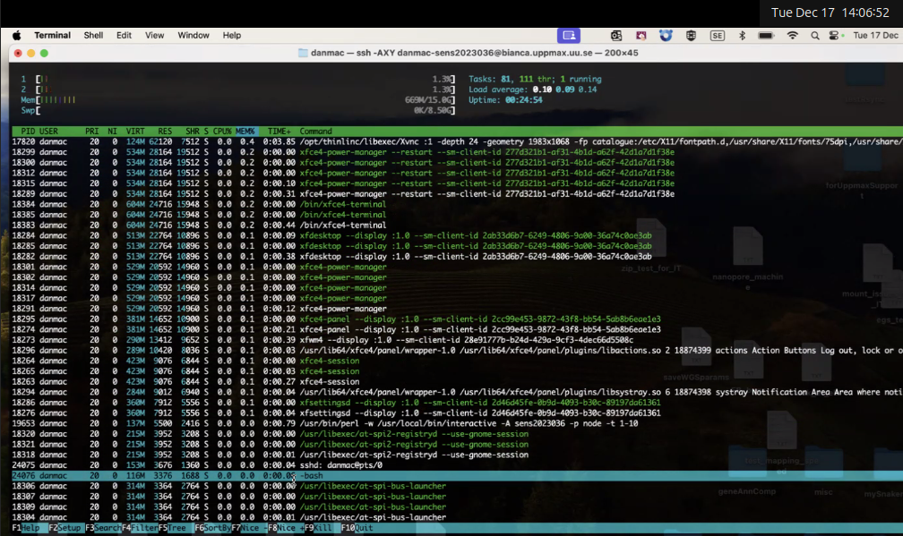

# Meeting 2024-12-17 14:00-15:00

- Discuss open question 5
    - The program `-bash` still shows up in `htop`, directly
      after logging into Bianca
- User shows complete process
    - Failed to get access to a Bianca compute noded, moved the
      meeting to next day
    - Collect exact error messages
    - Try to run core file using `gdb rstudio core.something`
    - Do `killall -bash` and run again
- Add Richel to the project
    - D will do so :-)

