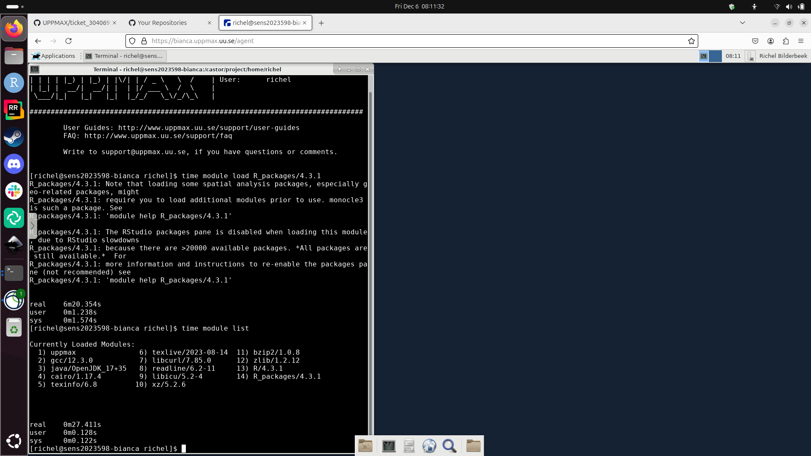

# ticket_304069

RT ticket 304069

## Hypotheses


- H1. The R version loaded by default is not compatible with the `R_Packages` or `RStudio` module loaded
- H2. When trying out another Bianca project, a different setup was used.
  Doing exactly the same script will result in the same results.
- H3. The problem is not in RStudio at all. It is in lmod, as loading
  modules is slow on Bianca

## Open questions

- What is the content of the `core.[number]` files?
- Does the same happen when using `bianca.uppmax.uu.se`?

## Open question 1

Does loading R_packages/4.3.1 load R? Which version? Allways the same?

### sens2016001

```
richel@richel-N141CU:~$ ssh richel-sens2016001@bianca.uppmax.uu.se
richel-sens2016001@bianca.uppmax.uu.se's password: 
Last login: Sun Nov 10 19:17:03 2024 from vpnpool188-114.anst.uu.se
############################################################################
# Login node NOT up! Boot initiated. Just wait for prompt                  #
# or login again later. This can take from 2 to 6 minutes                  #
############################################################################

****************************************************************************
* Notice! No second factor if you use password.                            *
* If you use ssh keys, you can get rid of this (second) prompt.            *
****************************************************************************
##


time module load R_packages/4.3.1
module list
```


### sens2023598 via SSH

- R version: 4.3.1
- Time: 6 minutes

```
[richel@sens2023598-bianca ~]$ 
[richel@sens2023598-bianca ~]$ module list
^C/usr/bin/lua: /usr/share/lmod/lmod/libexec/../tools/capture.lua:75: interrupted!
stack traceback:
	[C]: in function 'read'
	/usr/share/lmod/lmod/libexec/../tools/capture.lua:75: in function 'capture'
	/usr/share/lmod/lmod/libexec/../tools/TermWidth.lua:52: in function 'l_askSystem'
	/usr/share/lmod/lmod/libexec/../tools/TermWidth.lua:86: in function 'TermWidth'
	/usr/share/lmod/lmod/libexec/cmdfuncs.lua:375: in function 'cmd'
	/usr/share/lmod/lmod/libexec/lmod:513: in function 'main'
	/usr/share/lmod/lmod/libexec/lmod:584: in main chunk
	[C]: ?
Connection to sens2023598-bianca.uppmax.uu.se closed.
Connection to bianca.uppmax.uu.se closed.
richel@richel-N141CU:~$ ssh richel-sens2023598@bianca.uppmax.uu.se
richel-sens2023598@bianca.uppmax.uu.se's password: 
Last login: Fri Dec  6 07:42:45 2024 from vpnpool189-175.anst.uu.se
****************************************************************************
* Login node up and running. Redirecting now!                              *
* Notice! No second factor if you use password.                            *
* If you use ssh keys, you can get rid of this (second) prompt.            *
****************************************************************************

richel@sens2023598-bianca.uppmax.uu.se's password: 
Permission denied, please try again.
richel@sens2023598-bianca.uppmax.uu.se's password: 
Last login: Fri Dec  6 07:32:32 2024 from 172.18.144.254
 _   _ ____  ____  __  __    _    __  __
| | | |  _ \|  _ \|  \/  |  / \   \ \/ /   | System:    sens2023598-bianca
| | | | |_) | |_) | |\/| | / _ \   \  /    | User:      richel
| |_| |  __/|  __/| |  | |/ ___ \  /  \    | 
 \___/|_|   |_|   |_|  |_/_/   \_\/_/\_\   | 

###############################################################################

        User Guides: http://www.uppmax.uu.se/support/user-guides
        FAQ: http://www.uppmax.uu.se/support/faq

        Write to support@uppmax.uu.se, if you have questions or comments.


[richel@sens2023598-bianca ~]$ time module load R_packages/4.3.1
R_packages/4.3.1: Note that loading some spatial analysis packages, especially geo-related packages, might
R_packages/4.3.1: require you to load additional modules prior to use. monocle3 is such a package. See
R_packages/4.3.1: 'module help R_packages/4.3.1'

R_packages/4.3.1: The RStudio packages pane is disabled when loading this module, due to RStudio slowdowns
R_packages/4.3.1: because there are >20000 available packages. *All packages are still available.*  For 
R_packages/4.3.1: more information and instructions to re-enable the packages pane (not recommended) see
R_packages/4.3.1: 'module help R_packages/4.3.1'


real	6m1.265s
user	0m1.194s
sys	0m1.599s
[richel@sens2023598-bianca ~]$ time module list

Currently Loaded Modules:
  1) uppmax               6) texlive/2023-08-14  11) bzip2/1.0.8
  2) gcc/12.3.0           7) libcurl/7.85.0      12) zlib/1.2.12
  3) java/OpenJDK_17+35   8) readline/6.2-11     13) R/4.3.1
  4) cairo/1.17.4         9) libicu/5.2-4        14) R_packages/4.3.1
  5) texinfo/6.8         10) xz/5.2.6

 


real	0m31.461s
user	0m0.125s
sys	0m0.196s
[richel@sens2023598-bianca ~]$ 
```

### sens2023598 via website

- R version: 4.3.1
- Time: 6 minutes



### sens2017625

```
richel@richel-N141CU:~$ ssh richel-sens2017625@bianca.uppmax.uu.se
richel-sens2017625@bianca.uppmax.uu.se's password: 
Last login: Fri Dec  6 07:42:33 2024 from vpnpool189-175.anst.uu.se
############################################################################
# Login node NOT up! Boot initiated. Just wait for prompt                  #
# or login again later. This can take from 2 to 6 minutes                  #
############################################################################

****************************************************************************
* Notice! No second factor if you use password.                            *
* If you use ssh keys, you can get rid of this (second) prompt.            *
****************************************************************************
##################################################################
richel@sens2017625-bianca.uppmax.uu.se's password: 
 _   _ ____  ____  __  __    _    __  __
| | | |  _ \|  _ \|  \/  |  / \   \ \/ /   | System:    sens2017625-bianca
| | | | |_) | |_) | |\/| | / _ \   \  /    | User:      richel
| |_| |  __/|  __/| |  | |/ ___ \  /  \    | 
 \___/|_|   |_|   |_|  |_/_/   \_\/_/\_\   | 

###############################################################################

        User Guides: http://www.uppmax.uu.se/support/user-guides
        FAQ: http://www.uppmax.uu.se/support/faq

        Write to support@uppmax.uu.se, if you have questions or comments.


[richel@sens2017625-bianca ~]$ time module load R_packages/4.3.1
R_packages/4.3.1: Note that loading some spatial analysis packages, especially geo-related packages, might
R_packages/4.3.1: require you to load additional modules prior to use. monocle3 is such a package. See
R_packages/4.3.1: 'module help R_packages/4.3.1'

R_packages/4.3.1: The RStudio packages pane is disabled when loading this module, due to RStudio slowdowns
R_packages/4.3.1: because there are >20000 available packages. *All packages are still available.*  For 
R_packages/4.3.1: more information and instructions to re-enable the packages pane (not recommended) see
R_packages/4.3.1: 'module help R_packages/4.3.1'


real	6m4.584s
user	0m1.193s
sys	0m1.634s
[richel@sens2017625-bianca ~]$ time module list

Currently Loaded Modules:
  1) uppmax               6) texlive/2023-08-14  11) bzip2/1.0.8
  2) gcc/12.3.0           7) libcurl/7.85.0      12) zlib/1.2.12
  3) java/OpenJDK_17+35   8) readline/6.2-11     13) R/4.3.1
  4) cairo/1.17.4         9) libicu/5.2-4        14) R_packages/4.3.1
  5) texinfo/6.8         10) xz/5.2.6

 


real	0m31.708s
user	0m0.121s
sys	0m0.146s
[richel@sens2017625-bianca ~]$ ls
bianca	codium_is_here.txt  Desktop  R		  start_interactive.sh
bin	core.13061	    plot.R   sens2017625  video_demo.txt
[richel@sens2017625-bianca ~]$ time ls
bianca	codium_is_here.txt  Desktop  R		  start_interactive.sh
bin	core.13061	    plot.R   sens2017625  video_demo.txt

real	0m20.971s
user	0m0.008s
sys	0m0.075s

[richel@sens2017625-bianca ~]$ ll
total 36
drwxrwsr-x 2 richel richel  4096 Jan  9  2024 bianca
drwx--S--- 2 richel richel  4096 Apr 20  2023 bin
-rw-rw-r-- 1 richel richel     4 Dec 13  2023 codium_is_here.txt
-rw------- 1 richel richel 10200 Aug  8  2023 core.13061
drwxrwsr-x 2 richel richel  4096 Jun 14  2023 Desktop
-rw-rw-r-- 1 richel richel     0 Dec 13  2023 plot.R
drwxrwsr-x 4 richel richel  4096 Jun  8  2023 R
lrwxrwxrwx 1 richel richel    18 Jul 13  2023 sens2017625 -> /proj/sens2017625/
-rwxrwxr-x 1 richel richel    49 Dec 13  2023 start_interactive.sh
-rw-rw-r-- 1 richel richel     0 Dec 13  2023 video_demo.txt


```

Note `core.13061`

### Rackham

```
[richel@rackham2 ~]$ time module load R_packages/4.3.1
R_packages/4.3.1: Note that loading some spatial analysis packages, especially geo-related packages, might
R_packages/4.3.1: require you to load additional modules prior to use. monocle3 is such a package. See
R_packages/4.3.1: 'module help R_packages/4.3.1'

R_packages/4.3.1: The RStudio packages pane is disabled when loading this module, due to RStudio slowdowns
R_packages/4.3.1: because there are >20000 available packages. *All packages are still available.*  For 
R_packages/4.3.1: more information and instructions to re-enable the packages pane (not recommended) see
R_packages/4.3.1: 'module help R_packages/4.3.1'


real	0m0.758s
user	0m0.377s
sys	0m0.140s

[richel@rackham2 ~]$ module list

Currently Loaded Modules:
  1) uppmax               6) texlive/2023-08-14  11) bzip2/1.0.8
  2) gcc/12.3.0           7) libcurl/7.85.0      12) zlib/1.2.12
  3) java/OpenJDK_17+35   8) readline/6.2-11     13) R/4.3.1
  4) cairo/1.17.4         9) libicu/5.2-4        14) R_packages/4.3.1
  5) texinfo/6.8         10) xz/5.2.6

```

## Communication

### Nov 18 15:20:47 2024

> I have been having problems with my interactive RStudio sessions on bianca
> since last Friday. 

Which is Friday 15th November 2024, which is way after
the [maintenance on November 3rd](https://status.uppmax.uu.se/2024-11-03/november-maintenance/)
and before
[a next system status message (regarding Rackham) on 22nd November](https://status.uppmax.uu.se/2024-11-22/rackham-failed-jobs/)

> The RStudio interface is quite sluggish and gets stuck either just loading or in doing a simple task like loading an R package (for example limma). I wonder if there is something that has gone awry with my project or what has changed to cause this. I encounter this even when bianca is not particularly busy. I have tried shutting down my virtual session and logging in again several times, as well as restarting my browser, and still encounter a sluggish session. Below are the commands I use:

```text
## start an interactive session with a whole node ( I also tried variations of this with a few cores)
interactive -A sens2023036 -p node -t 2-10

## load R_packages module
module load R_packages/4.3.1

## load RStudio module
module load RStudio/2023.12.1-402

## start RStudio
rstudio
```

> The attached screenshots show the unchanged state of the session after several
> hours. 


Session at 10:55


Session at 11:44

> I also noticed “core” files appearing in my home path.
> I am attaching a screenshot of those as well.


> Could there be an issue with my project specifically
> or what do you think could be explaining the lag?

