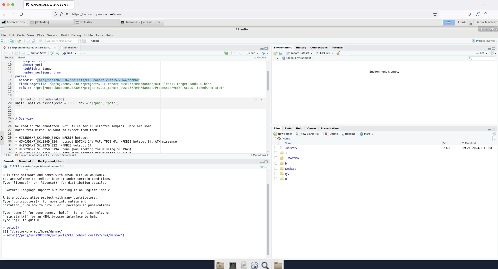

# ticket_304069

RT ticket 304069

## Hypotheses

Most likely at the top

- H5. The way the user opens RStudio is relevant
- H4. The `core.` files wll be helpful in finding the answer.
  See 'Open question 2: reading the `core.` files.
- [NEED USER] H2. When trying out another Bianca project, a different setup was used.
  Doing exactly the same script will result in the same results.
- [NEED ANSWER FROM COLLEAGUES] H3. The problem is not in RStudio at all. It is in lmod, as loading
  modules is slow on Bianca
  See 'Open question 1: loading `R_packages/4.3.1`' for details
- [REJECTED] H1. The R version loaded by default is not compatible with the `R_Packages`
  or `RStudio` module loaded.
  Rejected by 'Open question 1: loading `R_packages/4.3.1`'.

## Open questions

- What is the content of the `core.[number]` files?
  See 'Open question 2: reading the `core.` files'.
- How does the user start RStudio: `rstudio` or `rstudio &`?
  See 'Open question 3: how is RStudio started?'.
- [ANSWERED: YES] Does the same happen when using `bianca.uppmax.uu.se`?

## Open question 1: loading `R_packages/4.3.1`

Does loading R_packages/4.3.1 load R?
Which version?
Is it allways the same version?
Does it always take around the same time?

Project    |Setting                     |R module version|Real loading time
-----------|----------------------------|----------------|-----------------
Rackham    |SSH                         |4.3.1           |0m0.758s
sens2016001|SSH                         |Unknown         |Unknown
sens2023598|SSH                         |4.3.1           |6m1.265s
sens2023598|Website                     |4.3.1           |6m20.234s
sens2017625|SSH                         |4.3.1           |6m4.584s
sens2017625|Website, interactive session|4.3.1           |7m41.433s
sens2017625|SSH, interactive session    |4.3.1           |7m13.111s

This rejects H1.

For details, see [module_load.md](module_load.md)

I created this post at 2024-12-06 11:06:


> When I do time module load R_packages/4.3.1 I get load times that differ by
> a factor of >100x between Rackham (less then 1 second) and Bianca 
> (more then 6 minutes). Is there a reason for this? Exact timings and what I
> did can be found at
> https://github.com/UPPMAX/ticket_304069/blob/master/module_load.md#answers

- [ ] TODO: wait for answer

## 'Open question 2: reading the `core.` files

They are in the `core_files` folder

gdb rstudio core.7641


## Open question 3: how is RStudio started?

- How does the user start RStudio? `rstudio` or `rstudio &`?
- Do I see a difference when I do it?


Use sens2017625

time interactive -A sens2017625 -n 2 -t 2:00:00
time module load R_packages/4.3.1
time module load RStudio/2023.12.1-402
time rstudio
time rstudio &


## Communication

### Nov 18 15:20:47 2024

> I have been having problems with my interactive RStudio sessions on bianca
> since last Friday. 

Which is Friday 15th November 2024, which is way after
the [maintenance on November 3rd](https://status.uppmax.uu.se/2024-11-03/november-maintenance/)
and before
[a next system status message (regarding Rackham) on 22nd November](https://status.uppmax.uu.se/2024-11-22/rackham-failed-jobs/)

> The RStudio interface is quite sluggish and gets stuck either just loading or in doing a simple task like loading an R package (for example limma). I wonder if there is something that has gone awry with my project or what has changed to cause this. I encounter this even when bianca is not particularly busy. I have tried shutting down my virtual session and logging in again several times, as well as restarting my browser, and still encounter a sluggish session. Below are the commands I use:

```text
## start an interactive session with a whole node ( I also tried variations of this with a few cores)
interactive -A sens2023036 -p node -t 2-10

## load R_packages module
module load R_packages/4.3.1

## load RStudio module
module load RStudio/2023.12.1-402

## start RStudio
rstudio
```

> The attached screenshots show the unchanged state of the session after several
> hours. 


Session at 10:55



Session at 11:44

> I also noticed “core” files appearing in my home path.
> I am attaching a screenshot of those as well.


> Could there be an issue with my project specifically
> or what do you think could be explaining the lag?

### Dec 4 2024 98:42:10 from user

> I am creating a new ticket here (following up on ticket #303084), since the long email thread was causing problems with my Outlook and I could unfortunately no longer reply in that email thread.
> 
> Problem description: When starting an interactive session with RStudio on bianca (project sens2023036), RStudio pops up, but then keeps trying to load and I can never get started. I can see RStudio, but in the console it is lagging and I cannot type (keeps trying to load on the bottom right panel). This is even though I reserve an entire node for my interactive session and use the default R_packages and RStudio modules.
> 
> I have been in touch with Björn, and together we have tried the following, which unfortunately hasn’t resolved the issue:
> 
> * Deleting the .Rhistory and .RData files in my home directory
> * Launching RStudio from a location different than my home directory
> * Making sure there’s nothing weird in my .bashrc
> * Making sure there is no active conda environment in the background or other loaded module
> * $RSTUDIO_DISABLE_PACKAGES is TRUE
> * Removing files under “/home/danmac/.config/rstudio/Cache/Cache_Data” and “/home/danmac/.config/rstudio/Code Cache/js” with the exception of “index” and “index-dir/”. This deleted over 10,000 files.
> * Re-starting the log-in node
> * Testing other users can launch RStudio (they can)
> * Testing I can launch RStudio in another project (I can)
> * Making sure my R folders are small, and that I am not out of quota
> * Launching an interactive session with more memory (-C mem256GB)

