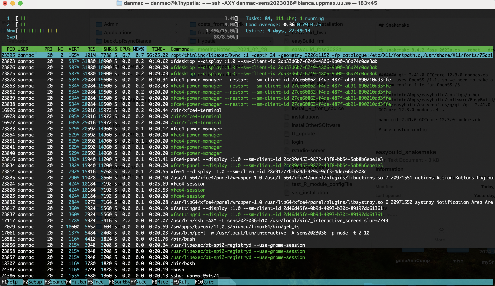
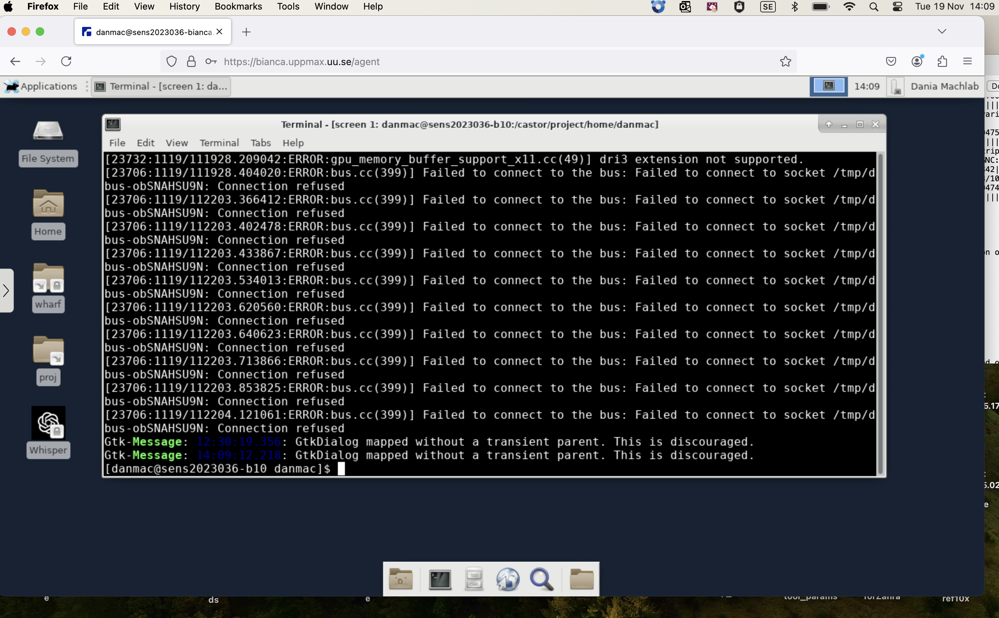

# ticket_304069

RT ticket 304069

- [communication](communication.md)

## Hypotheses

Most likely at the top

- H4. The `core.` files wll be helpful in finding the answer.
  See 'Open question 2: reading the `core.` files.
- [NEED USER] H2. When trying out another Bianca project, a different setup was used.
  Doing exactly the same script will result in the same results.
- [NEED ANSWER FROM COLLEAGUES] H3. The problem is not in RStudio at all. It is in lmod, as loading
  modules is slow on Bianca
  See 'Open question 1: loading `R_packages/4.3.1`' for details
- [UNLIKELY: works fine without `R_packages`]
  H5. The way the user opens RStudio is relevant
- [REJECTED] H1. The R version loaded by default is not compatible with the `R_Packages`
  or `RStudio` module loaded.
  Rejected by 'Open question 1: loading `R_packages/4.3.1`'.

## Open questions

- What is the content of the `core.[number]` files?
  See 'Open question 2: reading the `core.` files'.
- [IRRELEVANT: RStudio works fine without `R_packages`]
  How does the user start RStudio: `rstudio` or `rstudio &`?
  See 'Open question 3: how is RStudio started?'.
- [ANSWERED: YES] Does the same happen when using `bianca.uppmax.uu.se`?

## Open question 1: loading `R_packages/4.3.1`

- Does loading R_packages/4.3.1 load R?
    - Yes
- Which version?
    - 4.3.1
- Is it allways the same version?
    - Yes
- Does it always take around the same time?
    - Yes

For details, see [module_load.md](module_load.md)

## Open question 5: is the memory profile OK?



Note the `-bash` at the bottom. How did the user get this?
What do I get?

## Open question 4: which exact errors does the user get?

Errors when loading RStudio:

```
[richel@sens2017625-b9 core_files]$ rstudio
[10916:1217/111442.100955:ERROR:bus.cc(399)] Failed to connect to the bus: Failed to connect to socket /tmp/dbus-BZN1gjJ3g9: Connection refused
[10916:1217/111442.101141:ERROR:bus.cc(399)] Failed to connect to the bus: Failed to connect to socket /tmp/dbus-BZN1gjJ3g9: Connection refused
[10916:1217/111442.101204:ERROR:bus.cc(399)] Failed to connect to the bus: Failed to connect to socket /tmp/dbus-BZN1gjJ3g9: Connection refused
[10916:1217/111442.101260:ERROR:bus.cc(399)] Failed to connect to the bus: Failed to connect to socket /tmp/dbus-BZN1gjJ3g9: Connection refused
[10916:1217/111444.557058:ERROR:bus.cc(399)] Failed to connect to the bus: Failed to connect to socket /tmp/dbus-BZN1gjJ3g9: Connection refused
[10916:1217/111444.615756:ERROR:bus.cc(399)] Failed to connect to the bus: Failed to connect to socket /tmp/dbus-BZN1gjJ3g9: Connection refused
[10916:1217/111444.629603:ERROR:object_proxy.cc(590)] Failed to call method: org.freedesktop.portal.Settings.Read: object_path= /org/freedesktop/portal/desktop: unknown error type: 
[10916:1217/111444.952164:ERROR:bus.cc(399)] Failed to connect to the bus: Failed to connect to socket /tmp/dbus-BZN1gjJ3g9: Connection refused
[10916:1217/111620.143324:ERROR:bus.cc(399)] Failed to connect to the bus: Failed to connect to socket /tmp/dbus-BZN1gjJ3g9: Connection refused
[10916:1217/111620.191627:ERROR:bus.cc(399)] Failed to connect to the bus: Failed to connect to socket /tmp/dbus-BZN1gjJ3g9: Connection refused
[10916:1217/111620.318315:ERROR:bus.cc(399)] Failed to connect to the bus: Failed to connect to socket /tmp/dbus-BZN1gjJ3g9: Connection refused
[10916:1217/111620.391250:ERROR:bus.cc(399)] Failed to connect to the bus: Failed to connect to socket /tmp/dbus-BZN1gjJ3g9: Connection refused
[10916:1217/111620.432251:ERROR:bus.cc(399)] Failed to connect to the bus: Failed to connect to socket /tmp/dbus-BZN1gjJ3g9: Connection refused
[10916:1217/111620.565485:ERROR:bus.cc(399)] Failed to connect to the bus: Failed to connect to socket /tmp/dbus-BZN1gjJ3g9: Connection refused
[10916:1217/111620.883850:ERROR:bus.cc(399)] Failed to connect to the bus: Failed to connect to socket /tmp/dbus-BZN1gjJ3g9: Connection refused
[10916:1217/111620.922001:ERROR:bus.cc(399)] Failed to connect to the bus: Failed to connect to socket /tmp/dbus-BZN1gjJ3g9: Connection refused
```

- [ ] Check user logs



## 'Open question 2: reading the `core.` files

- [Kevin Ushey](https://forum.posit.co/t/core-dump-from-rstudio/3155/2)
    - Useless
- [sqlite DB core dump](https://forum.posit.co/t/rstudio-core-dump-when-querying-sqlite-db/8921/1)
    - Not useful
    - !!!May be locale
- [RStudio 'core' folder](https://github.com/rstudio/rstudio/tree/main/src/cpp/core)

They are in the `core_files` folder

Do:

```bash
cd core_files
interactive -A sens2017625 -n 2 -t 2:00:00
module load R_packages/4.3.1
module load RStudio/2023.12.1-402
gdb rstudio core.7641
```

Results: is not a core dump ...?

```
[richel@sens2017625-b9 core_files]$ gdb rstudio core.7641
GNU gdb (GDB) Red Hat Enterprise Linux 7.6.1-120.el7
Copyright (C) 2013 Free Software Foundation, Inc.
License GPLv3+: GNU GPL version 3 or later <http://gnu.org/licenses/gpl.html>
This is free software: you are free to change and redistribute it.
There is NO WARRANTY, to the extent permitted by law.  Type "show copying"
and "show warranty" for details.
This GDB was configured as "x86_64-redhat-linux-gnu".
For bug reporting instructions, please see:
<http://www.gnu.org/software/gdb/bugs/>...
Reading symbols from /sw/apps/RStudio/2023.12.1-402/rackham/rstudio...
warning: Unable to open "librpm.so.3" (/sw/apps/xz/5.2.6/bianca/lib/liblzma.so.5: version `XZ_5.1.2alpha' not found (required by /lib64/librpmio.so.3)), missing debuginfos notifications will not be displayed
Missing separate debuginfo for /sw/apps/RStudio/2023.12.1-402/rackham/rstudio
Try: yum --enablerepo='*debug*' install /usr/lib/debug/.build-id/c9/a5c4e4a9489e5a017327ea9770a718fb9a8e66.debug
(no debugging symbols found)...done.
"/castor/project/home/richel/core_files/core.7641" is not a core dump: File truncated
(gdb) bt
No stack.
(gdb)
```

## [IRRELEVANT] Open question 3: how is RStudio started?

- How does the user start RStudio? `rstudio` or `rstudio &`?
- Do I see a difference when I do it?

On the meeting of 2024-12-06 the user stated that
running RStudio without `R_packages` works fine.
Hence, it seems irrelevant how RStudio is started exactly

Use `richel-sens2017625`, then:

```
time interactive -A sens2017625 -n 2 -t 2:00:00
time module load R_packages/4.3.1
time module load RStudio/2023.12.1-402
time rstudio
time rstudio &
```

