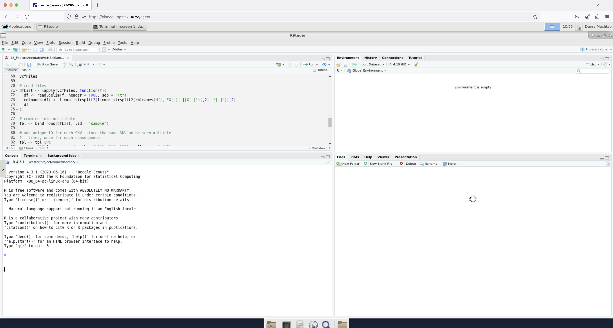
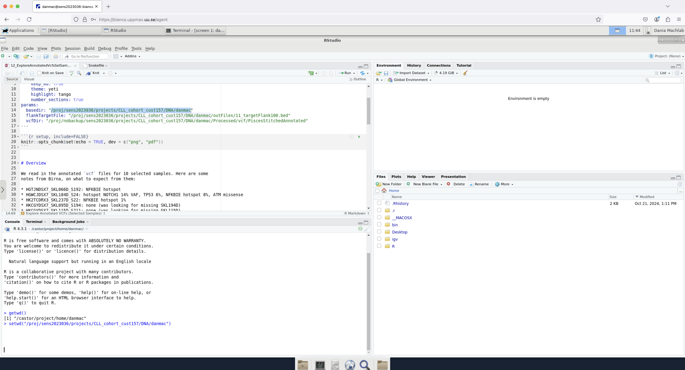
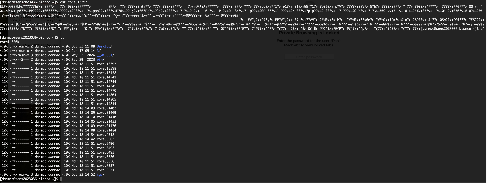
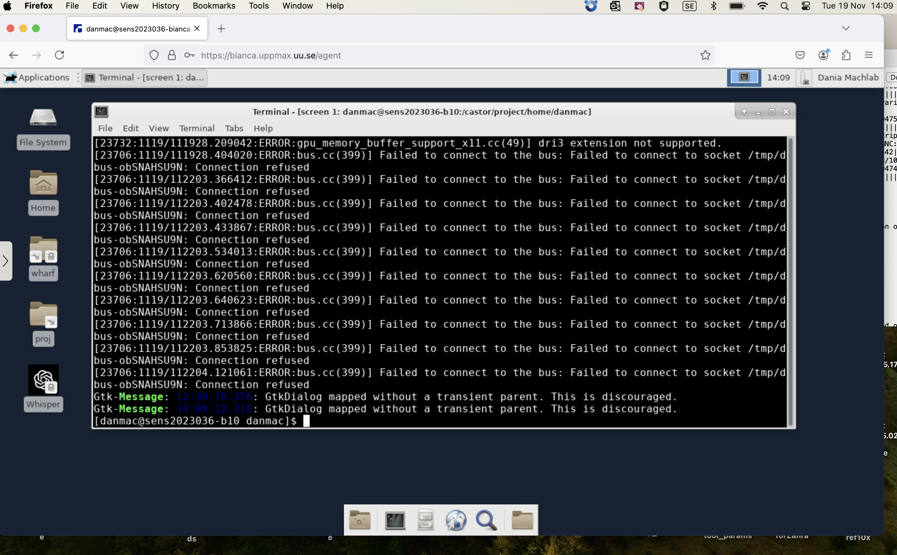
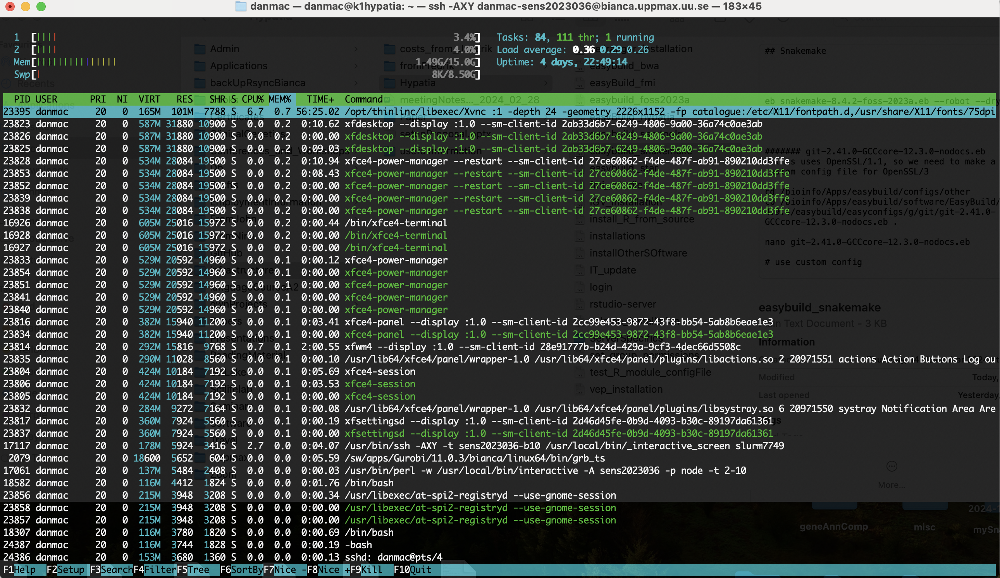

# Communication

## Mon Nov 18 15:20:47 2024 user - Ticket created [Reply] [Comment]

I have been having problems with my interactive RStudio sessions on bianca since last Friday. The RStudio interface is quite sluggish and gets stuck either just loading or in doing a simple task like loading an R package (for example limma). I wonder if there is something that has gone awry with my project or what has changed to cause this. I encounter this even when bianca is not particularly busy. I have tried shutting down my virtual session and logging in again several times, as well as restarting my browser, and still encounter a sluggish session. Below are the commands I use:

```
## start an interactive session with a whole node ( I also tried variations of this with a few cores)
interactive -A sens2023036 -p node -t 2-10

## load R_packages module
module load R_packages/4.3.1

## load RStudio module
module load RStudio/2023.12.1-402

## start RStudio
rstudio
```


The attached screenshots show the unchanged state of the session after several hours. I also noticed “core” files appearing in my home path. I am attaching a screenshot of those as well. Could there be an issue with my project specifically or what do you think could be explaining the lag? Many thanks in advance for your help!





## Mon Nov 18 16:27:46 2024 BC (UPPMAX) - Correspondence added 10 minutes [Reply] [Comment]

Try allocating at lease 2 cores fore the interactive session.
You may also try the next-latest RStudio version, just before 2023.12., i.e. RStudio/2023.06.2-561.

## Mon Nov 18 16:39:17 2024 user - Correspondence added [Reply] [Comment]

Thanks for your quick reply. I have been allocating several cores with this. However, using a different RStudio module seems to have worked. Many thanks!

## Mon Nov 18 19:59:54 2024 BC (UPPMAX) - Correspondence added 5 minutes [Reply] [Comment]

Good it works!

Sorry I missed that you tried a whole node.

Which version of RStudio do you get when you just load it without version set?

## Mon Nov 18 20:06:15 2024 BC (UPPMAX) - Correspondence added 10 minutes [Reply] [Comment]

...

## Tue Nov 19 11:29:27 2024 user - Correspondence added [Reply] [Comment]

Thanks for checking this. Indeed, I was using specific versions (R_packages/4.3.1
and RStudio/2023.12.1-402) for reproducibility reasons. With RStudio it
matters less so, so that’s ok. However today I am running into the same
problems again, and even got an email that I am running out of memory when
RStudio is simply trying to launch. I see RStudio open up but stuck (as in
the screenshots I originally shared). This is with 10 nodes in my
interactive session, so it’s a bit odd.

I wonder if I broke something last week, when I had to ctrl+c in the
terminal running RStudio to exit, since it was stuck and wouldn’t close.


## Tue Nov 19 13:14:18 2024 BC (UPPMAX) - Correspondence added 10 minutes [Reply] [Comment]

From your images it looks like you are still running on bianca login node.

Are you sure you are starting RStudio from the terminal screen where the
interactive sessions starts? You should have a "b<number>" address, not a
"bianca" address.

## Tue Nov 19 14:22:39 2024 user - Correspondence added [Reply] [Comment]

I am attaching the images here which show the issue from the interactive session (10 nodes) which I currently have running, called “sens2023036-b10”. Thanks!

## Tue Nov 19 14:22:41 2024 The RT System itself - Status changed from 'resolved' to 'open'
## Tue Nov 19 14:50:16 2024 BC (UPPMAX) - Correspondence added 10 minutes [Reply] [Comment]
## Tue Nov 19 15:16:00 2024 user - Ticket #303153: - Ticket created [Reply] [Comment]
## Tue Nov 19 15:23:57 2024 user - Ticket #303154: - Ticket created [Reply] [Comment]





## Tue Nov 19 15:43:09 2024 user - Correspondence added [Reply] [Comment]
## Tue Nov 19 15:58:15 2024 AA (UPPMAX) - Ticket #303154: - Merged into #303084: Problems interacting with RStudio
## Tue Nov 19 15:58:15 2024 AA (UPPMAX) - Ticket #303153: - Merged into #303084: Problems interacting with RStudio
## Tue Nov 19 16:00:03 2024 AA (UPPMAX) - Ticket #303153: - Merged into #303084: Problems interacting with RStudio
## Tue Nov 19 16:00:03 2024 AA (UPPMAX) - Merged into #303084: Problems interacting with RStudio
## Tue Nov 19 16:21:26 2024 BC (UPPMAX) - Correspondence added [Reply] [Comment]
## Tue Nov 19 16:26:22 2024 BC (UPPMAX) - Correspondence added 10 minutes [Reply] [Comment]
## Tue Nov 19 16:27:39 2024 BC (UPPMAX) - Correspondence added [Reply] [Comment]
## Tue Nov 19 16:28:26 2024 BC (UPPMAX) - Status changed from 'open' to 'resolved'
## Thu Nov 21 14:20:05 2024 user - Correspondence added [Reply] [Comment]
## Thu Nov 21 14:20:06 2024 The RT System itself - Status changed from 'resolved' to 'open'
## Thu Nov 21 14:25:23 2024 user - Correspondence added [Reply] [Comment]
## Mon Nov 25 13:01:13 2024 BC (UPPMAX) - Correspondence added 5 minutes [Reply] [Comment]
## Mon Nov 25 14:14:53 2024 user - Correspondence added [Reply] [Comment]
## Mon Nov 25 14:43:49 2024 BC (UPPMAX) - Correspondence added [Reply] [Comment]
## Mon Nov 25 14:50:24 2024 user - Correspondence added [Reply] [Comment]
## Mon Nov 25 14:55:00 2024 BC (UPPMAX) - Correspondence added 5 minutes [Reply] [Comment]
## Mon Nov 25 14:58:39 2024 user - Correspondence added [Reply] [Comment]
## Mon Nov 25 15:02:06 2024 BC (UPPMAX) - Correspondence added 5 minutes [Reply] [Comment]
## Mon Nov 25 15:09:31 2024 user - Correspondence added [Reply] [Comment]
## Wed Nov 27 11:55:30 2024 BC (UPPMAX) - Comments added 30 minutes [Reply] [Comment]
## Wed Nov 27 11:57:24 2024 BC (UPPMAX) - Correspondence added [Reply] [Comment]
## Wed Nov 27 11:59:09 2024 BC (UPPMAX) - Correspondence added [Reply] [Comment]
## Wed Nov 27 13:34:12 2024 user - Correspondence added [Reply] [Comment]
## Wed Nov 27 13:48:16 2024 user - Correspondence added [Reply] [Comment]
## Wed Nov 27 14:11:46 2024 BC (UPPMAX) - Correspondence added [Reply] [Comment]
## Thu Nov 28 16:30:28 2024 BC (UPPMAX) - Correspondence added [Reply] [Comment]
## Fri Nov 29 10:17:21 2024 user - Correspondence added [Reply] [Comment]
## Mon Dec 02 08:59:48 2024 BC (UPPMAX) - Untaken
## Mon Dec 02 13:35:51 2024 BC (UPPMAX) - Correspondence added 5 minutes [Reply] [Comment]
## Mon Dec 02 13:35:53 2024 The RT System itself - Given to BC (UPPMAX) 
## Mon Dec 02 16:04:15 2024 user - Correspondence added [Reply] [Comment]
## Mon Dec 02 16:20:56 2024 BC (UPPMAX) - Correspondence added [Reply] [Comment]
## Mon Dec 02 16:25:18 2024 BC (UPPMAX) - Correspondence added 10 minutes [Reply] [Comment]
## Mon Dec 02 16:29:36 2024 user - Correspondence added [Reply] [Comment]
## Mon Dec 02 16:43:06 2024 user - Correspondence added [Reply] [Comment]
## Mon Dec 02 23:05:53 2024 BC (UPPMAX) - Correspondence added 5 minutes [Reply] [Comment]
## Tue Dec 03 10:13:22 2024 user - Correspondence added [Reply] [Comment]
## Tue Dec 03 11:07:51 2024 BC (UPPMAX) - Correspondence added [Reply] [Comment]
## Tue Dec 03 11:27:45 2024 user - Correspondence added [Reply] [Comment]
## Wed Dec 04 09:09:47 2024 BC (UPPMAX) - Correspondence added 5 minutes [Reply] [Comment]
## Wed Dec 04 09:10:48 2024 BC (UPPMAX) - Status changed from 'open' to 'resolved'

## NEW

## Dec 4 2024 98:42:10 from user

> I am creating a new ticket here (following up on ticket #303084), since the long email thread was causing problems with my Outlook and I could unfortunately no longer reply in that email thread.
> 
> Problem description: When starting an interactive session with RStudio on bianca (project sens2023036), RStudio pops up, but then keeps trying to load and I can never get started. I can see RStudio, but in the console it is lagging and I cannot type (keeps trying to load on the bottom right panel). This is even though I reserve an entire node for my interactive session and use the default R_packages and RStudio modules.
> 
> I have been in touch with Björn, and together we have tried the following, which unfortunately hasn’t resolved the issue:
> 
> * Deleting the .Rhistory and .RData files in my home directory
> * Launching RStudio from a location different than my home directory
> * Making sure there’s nothing weird in my .bashrc
> * Making sure there is no active conda environment in the background or other loaded module
> * $RSTUDIO_DISABLE_PACKAGES is TRUE
> * Removing files under “/home/danmac/.config/rstudio/Cache/Cache_Data” and “/home/danmac/.config/rstudio/Code Cache/js” with the exception of “index” and “index-dir/”. This deleted over 10,000 files.
> * Re-starting the log-in node
> * Testing other users can launch RStudio (they can)
> * Testing I can launch RStudio in another project (I can)
> * Making sure my R folders are small, and that I am not out of quota
> * Launching an interactive session with more memory (-C mem256GB)

## Meeting notes 2024-12-06 14:00

- User cannot demonstrate, due to a reported Bianca slowness that needs fixing
- Either meet Tuesday 17 Dec afternoon, or ask another colleague to take over
    - Decision: meet Tuesday 17 Dec 14:00

From user:

`module load rstudio` works fine,
but `module load R_packages` and `module load rstudio`
gives a problem. Those packages are needed!

## Meeting 2024-12-17 14:00-15:00

See [here](20241217_meeting/README.md).

## Meeting 2024-12-18 9:00-10:00 and 11:00-11:05

See [here](20241218_meeting/README.md).
